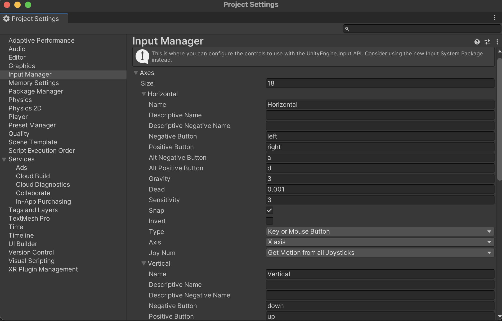

## **유니티 물체의 이동감지**

---

&nbsp;&nbsp; 물체의 이동을 감지하는 방법으로 Input 클래스의 GetKey 메서드를 사용해 물체의 이동으로 설정된 키가 눌렸을 때를 확인하는 방법이 있다. 이 방법의 단점은 나중에 이동과 관련된 키를 다른 키로 바꾸고 싶을 때 GetKey의 파라미터 값을 수동으로 수정해주어야 한다는 것이다.

<br><br>

### **GetAxis**

```c#
// x축 (빨간색)
Input.GetAxis("Horizontal")

// z축 (파란색)
Input.GetAxis("Vertical")

```

&nbsp;&nbsp; 보다 좋은 방법은 GetAxis 메서드를 사용하는 방법이다. GetAxis 메서드는 아래 그림과 같이 프로젝트 설정에 지정된 Horizontal, Vertical에 해당하는 키가 감지되었을 때 그 조작을 확인하는 메서드이다. 기준 값은 0이며 음수일 때는 Negative에 지정된 키가, 양수일 때는 Positive에 등록된 키가 눌렸을 떄를 가리킨다.

<br>

<p align="center">
    
</p></br>

<br><br>

### **이동감지**

&nbsp;&nbsp; 앞서 언급했듯이 GetAxis는 이동이 감지되지 않았을 때 0을, 이외의 상황에서 양수 혹은 음수의 값을 반환한다. 이를 이용해 움직임을 체크하는 조건 분기는 아래와 같이 작성하면 된다.

```c#
bool hasHorizontalInput = !Mathf.Approximately(Input.GetAxis("Horizontal"), 0f);
bool hasVerticalInput = !Mathf.Approximatley(Input.GetAxis("Vertical"), 0f);

// 이동 감지
if (hasHorizontalInput || hasVerticalInput) {
    // ...조건부 로직
}
```
