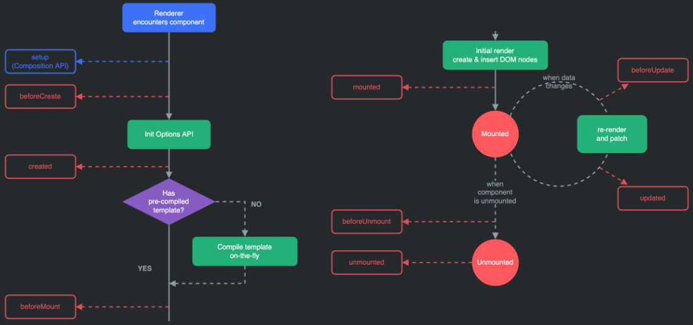

# 📄 **Vue Life Cycle**

    

 

&nbsp;&nbsp;Vue 인스턴스는 생성될 때 일련의 다음과 같은 일련의 초기화 단계를 거친다.

- 데이터 관찰 설정이 필요한 경우
- 템플릿을 컴파일 하는 경우
- 인스턴스를 DOM에 마운트 하는 경우
- 데이터가 변경되어 DOM을 업데이트하는 경우
   

&nbsp;&nbsp;이러한 과정에서 사용자 정의 로직을 실행할 수 있는 Life Cylcle Hooks가 호출되는데 이는 크게 <u>**생성(Create), 부착(Mount), 갱신(Update), 소멸(Destroy)의 4단계**</u>로 구성된다. 모든 Life Cycle Hooks는 자동으로 this 컨텍스트를 인스턴스에 바인딩하기 때문에 데이터 및 계산된 속성, 메서드 등에 this를 활용하여 접근할 수 있다.(다만 JS의 특성상 화살표 함수를 사용해 Hooks를 정의하면 인스턴스를 가리키지 않음)
 

## **Life Cycle Hooks**

&nbsp;&nbsp;Life Cycle Hooks는 인스턴스의 생명주기에서 실행되는 커스텀 로직을 말한다. Life Cycle Hooks에는 beforeCreate, created, beforeMount, mounted, beforeUpdate, updated, beforeDestry, destroyed의 총

### **beforeCreate**

&nbsp;&nbsp;인스턴스가 초기화 된 후 데이터 관찰 및 이벤트/감시자 설정 전에 동기적으로 호출되는 생명주기 메서드. 이 단계에서는 data 속성과 methods 속성이 아직 인스턴스에 정의되어 있지 않으며 DOM과 같은 화면 요소에도 접근할 수 없다.
 

### **created**

&nbsp;&nbsp;인스턴스가 생성된 후 동기적으로 호출되는 생명주기 메서드로 데이터 처리, 계산된 속성, 메서드, 감시/이벤트 콜백 등과 같은 <u>옵션처리가 완료</u>됨. 마운트가 시작되지 않았으므로 DOM에는 접근할 수 없으며 data 속성과 methods 속성은 정의되었기 때문에 해당 속성들에는 접근하여 로직을 수행하는 것이 가능하다. 이를 이용해 <u>서버에 데이터를 요청하여 받아오는 로직을 수행</u>하는 데 많이 사용된다.
 

### **beforeMount**

&nbsp;&nbsp;마운트가 시작되기 전에 호출되는 생명주기 메서드로 Javascript의 render() 함수가 호출되기 전에 실행되므로 직전에 추가할 로직은 이 부분에서 실행된다.
 

### **mounted**

&nbsp;&nbsp;지정된 DOM 요소에 Vue 인스턴스 데이터가 마운트 된 후에 호출되는 생명주기 메서드이다. <u>**template 속성에 정의한 DOM에 접근할 수 있어 화면 요소를 제어하는 로직을 수행하기 좋은 단계**</u>이다. 주의해야 할 것은 하위 컴포넌트나 외부 라이브러리에 의해 추가된 화면 요소들이 최종적으로 HTML 코드로 변환되는 시점과 다를 수 있다는 점이다.
 

### **beforeUpdated**

&nbsp;&nbsp;데이터가 변경될 때 virtual DOM이 렌더링/패치 되기 전에 호출되는 생명주기 메서드이다. 화면을 다시 그리기 전에 호출되는 메서드이기 때문에 변경 예정인 새 데이터에 접근할 수 있어 변경 예정인 데이터의 값과 관련된 로직을 넣을 수 있다.
 

### **updated**

&nbsp;&nbsp;Vue에서 관리되는 데이터가 변경되어 DOM이 업데이트된 상태에서 호출되는 생명주기 메서드이다. <u>**데이터가 변경된 후 화면 요소를 제어하기 위한 로직을 추가하기 좋은 단계**</u>이다. 이 단계에서 데이터를 변경하면 무한 루프에 빠질 수 있으므로 데이터 값을 갱신하는 로직은 되도록 beforeUpdate 단계에 추가하는 것이 좋다.
 

### **beforeDestory**

&nbsp;&nbsp;Vue 인스턴스가 제거되기 전에 호출되는 생명주기 메서드이다. 아직까지는 인스턴스에 접근할 수 있으므로 뷰 인스턴스의 데이터를 삭제하기에 좋은 단계이다.
 

### **destroyed**

&nbsp;&nbsp;Vue 인스턴스가 제거된 후에 호출되는 생명주기 메서드.
 
