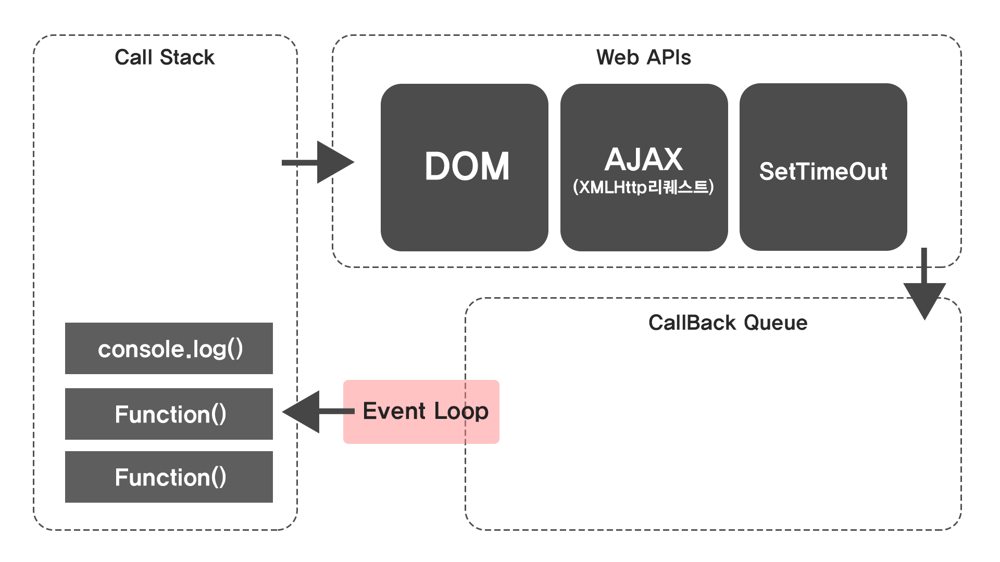

# 📄 **AJAX**

### **Javascript 이벤트 처리과정**

<p align="center">
    
</p></br>
&nbsp;&nbsp;Javascript는 기본적으로 <u>Single thread</u>이다. 이벤트를 처리하는 Call Stack이 하나이며 즉시 처리하지 못하는 이벤트들은 <u>Web API</u>로 보내서 처리한다. Web API에서 처리된 이벤트들은 처리된 순서대로 <u>Task Queue</u>에 저장되고, Call Stack이 비게 되었을 때 Event Loop에 의해 Task Queue에서 가장 오래된 이벤트부터 Call Stack으로 보낸다.
<br><br>

## **AJAX(Asynchronous Javascript and XML)**

&nbsp;&nbsp;AJAX는 비동기적으로 Javascript와 XML을 사용한 통신을 의미하며 페이지 전체를 새로고침 하지 않고도 수행되는 비동기성 이벤트이다. 이전에는 서버와의 통신을 위해 XMLHttpRequest 객체를 직접 사용했는데 XMLHttpRequest 이외에도 fetch, axios 등 다양한 방법을 통해 비동기 통신을 구현할 수 있다. AJAX는 전달 데이터 포맷은 JSON, XML, HTML, Text 등으로 다양하다.
<br>

### **순차적인 비동기 처리**

&nbsp;&nbsp;위에서 살펴본 이벤트 처리과정에서 Web API로 들어온 이벤트가 들어온 순서와 무관하게 어떤 이벤트가 먼저 처리되느냐에 따라 Task Queue로 넘어가는 순서가 결정된다.

&nbsp;&nbsp;비동기를 처리하는 방법을 둘로 구분하면 Async Callback을 사용하여 백그라운드에서 실행할 함수를 콜백함수로 호출하는 방식이 있으며 대표적으로 XMLHttpRequest를 사용한 방법과 fetch를 사용하는 방법이 있다. 다른 방법으로는 Promise-style이 있는데 이는 Modern Web API에서 적용된 새로운 스타일로 XMLHttpRequest 객체를 사용하는 구조보다 현대적인 버전이다.
<br>

### **XMLHttpRequest**

&nbsp;&nbsp;XMLHttpRequest는 비동기 이벤트처리를 위한 가장 기본적인 방법이다. AJAX 프로그래밍을 위해 주로 사용되며 XML이라는 이름이 붙은 것과 달리 JSON, XML, HTML, Text 등 다양한 종류의 데이터를 받아 올 수 있다. XMLHttpRequest는 HTTP 이외에도 FTP, FILE 등의 프로토콜을 지원한다.

```javascript
const xhr = new XMLTHttpRequest();
xhr.onreadstatechange = () => {
  if (this.status == 200 && this.readystate == this.DONE) {
    let data = xhr.responseText; // 요청한 데이터를 문자열로 반환
  }
};
xhr.open("GET", "/URL", true);
xhr.send();
```

<br>

### **Promise**

&nbsp;&nbsp;앞에서 XMLHttpRequest 객체를 사용하는 방법에 대해서 알아보았으니 이번에는 조금 더 현대적인 방식인 Promise에 대해서 살펴보자.

&nbsp;&nbsp;비동기 작업에 대한 결과가 반환되는 시점에 그 결과 값을 가져오게 하기 위한 것이 Promise 객체이다. Promise 객체는 비동기 작업을 동기 작업처럼 값을 반환하여 사용하도록 하기 위한 객체로 이벤트의 결과에 대해 미래의 완료, 또는 실패, 결과값을 반환한다.

&nbsp;&nbsp;Promise는 대기(pending), 이행(fulfilled), 거부(rejected)의 세가지 상태를 가지는데 초기에 대기 중인 프로미스는 값과 함께 이행될 수도 오류 등으로 거부될 수도 있다.

- 대기(pending) : 비동기 요청이 이행되지도, 거부되지도 않은 초기 상태
- 이행(fulfilled) : 비동기 요청이 성공적으로 완료된 상태
- 거부(rejected) : 비동기 요청이 실패하거나 오류가 발생한 상태
  <br>

&nbsp;&nbsp;Promise 객체는 resolve와 reject 인자를 파라미터로 갖는다. resolves는 요청에 대한 결과가 성공 시에, reject는 실패 시에 사용되는 객체이다. 비동기 통신이 정상적으로 성공적으로 처리되어 응답을 받았을 경우에 resolve에 의해 .then 구문이 호출되고, 만약 오류 등에 의해 정상적인 응답을 받지 못했다면 reject를 호출하여 .catch문을 실행한다.

```javascript
const fetchData = () => {
  return new Promise((resolve, reject) => {
    const response = fetch(url, {
      /* ..fetch Obj.. */
    });

    if (response.status == 200) {
      /* 비동기 요청에 대한 정상 응답 */
      resolve("success");
    } else {
      /* 이외 */
      reject("rejected");
    }
  });
};

fetchData()
  .then((data) => {
    console.log(result);
  })
  .catch((err) => {
    console.log(err);
  });
```
