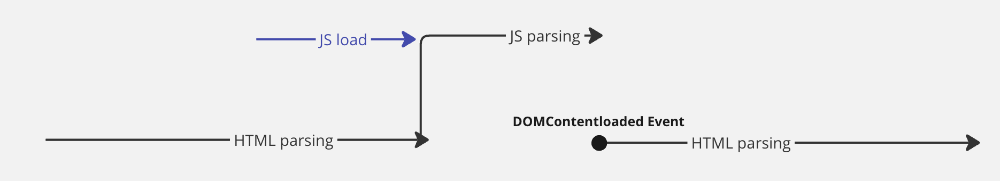
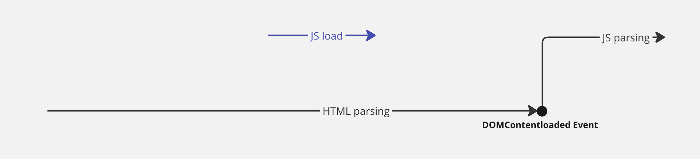

&nbsp;&nbsp;지난 [포스트](./브라우저%20렌더링%201.md)에서는 브라우저가 서버로부터 받은 HTML, CSS 문서로 어떻게 렌더링이 진행되는지 살펴보았습니다. 이번에는 응답으로 받은 Javascript 문서가 렌더링에 어떤 영향을 미치는지, 어떤 과정을 거쳐 DOM을 수정하는지 살펴보겠습니다.

<br>

## Javascript 파싱과 실행

&nbsp;&nbsp;HTML 문서를 파싱하는 과정에서 `script` 태그를 만나면 렌더링 엔진은 DOM 생성을 중단하고 `src` 태그에 정의된 javascript 파일을 파싱하기 위해 제어권을 자바스크립트 엔진에 넘겨줍니다. javascript 코드의 파싱과 실행은 자바스크립트 엔진에 의해 진행되는데, 이러한 자바스크립트 엔진은 브라우저 환경에 따라 다르지만 모두 `ECMAScript` 표준을 따르고 있습니다.

<br>

### AST(Abstract Syntax Tree)

&nbsp;&nbsp;렌더링 엔진이 DOM과 CSSOM을 생성하는 것과 마찬가지로 자바스크립트 엔진은 Javascript 문서를 파싱해 `AST(Abstract Syntax Tree`라는 독특한 자료구조를 생성합니다. 다음은 엔진이 Javascript를 파싱하는 과정입니다.

<br>

**Javascript 파싱 과정**

1. 토크나이징(Tokenizing) : 엔진 내의 `토크나이저(tokenizer)` 는 자바스크립트 문서를 토대로 문법적 의미를 갖는 최소 단위인 `토큰(token)`으로 분해합니다.
2. 파싱(Parsing) : 토큰의 집합을 구문별로 분석해 `AST`를 생성합니다. `AST`는 토큰이 갖는 문법적 의미와 구조를 반영해 트리 구조로 이루어져 있습니다.
3. 실행(Execution) : `AST`는 인터프리터가 실행할 수 있도록 `바이트코드`로 변환되고 실행됩니다.

<br>

>[!tip]  HTML 문서  `script` 태그의 위치
>
>&nbsp;&nbsp;아까 렌더링 엔진이 DOM을 생성하는 과정에 `script` 태그를 만나면 DOM 생성을 중단한다고 했듯 javascript의 파싱은 메인 쓰레드에서 동기적으로 이루어집니다. 만약 `script` 태그가 HTML 문서 상단에 있고, 코드 내 DOM이나 CSSOM을 수정하는 로직이 있다면 어떻게 될까요?
>
>&nbsp;&nbsp;javascript의 파싱이 끝나고 실행되는 과정에서 HTML 블로킹이 발생하기 때문에 아직 DOM 생성이 완료되지 않은 상태로 javascript 코드가 어떤 요소에 접근하려고 한다면 이 코드는 의도대로 동작하지 않을 수 있습니다.
>
>&nbsp;&nbsp;이러한 이유로 javascript는 `body` 태그가 닫히기 바로 이전에  `script` 태그로 추가해 전체 DOM 생성이 완료된 이후에 등장하는 편이 예기치 않은 오류를 방지할 수 있고, 중간에 DOM 생성을 블로킹하지 않으므로 초기 렌더링 성능에도 유리합니다.

<br>

## Javascript 성능 이슈

### 1. 리플로우 & 리페인트

&nbsp;&nbsp;이전 포스트에서도 살펴본 것처럼 javascript는 `DOM API`를 통해 DOM이나 CSSOM를 수정하고 리렌더링을 유발할 수 있습니다. 리렌더링은 크게 요소의 위치, 크기, 패딩, 마진 등이 변경되었을 때 레이아웃 계산을 실행해 레이아웃을 조정하는 `리플로우(Reflow)`와 재결합된 `렌더 트리(Render Tree)`를 기반으로 실제 브라우저의 픽셀에 요소를 렌더링하는 `리페인트(Repaint)`로 구성되는데 리렌더링은 서비스의 성능에 영향을 줄 수 있으므로 불필요한 리렌더링은 최소화하는 것이 좋습니다.

<br>

### 2. async/defer 어트리뷰트

&nbsp;&nbsp;javascript의 파싱과 실행이 DOM 생성과 동기적으로 실행되므로 발생하는 문제를 해결하기 위해 `async`와 `defer` 어트리뷰트가 추가되었습니다. 두 어트리뷰트는 `script`의 `src` 어트리뷰트로 기재된 javascript를 파싱하는 경우에만 사용이 가능하며 인라인 방식으로 작성된 `script`에는 사용할 수 없습니다.

<br>

**async**



&nbsp;&nsbp;`async` 어트리뷰트는 javascript 파일의 로드가 비동기적으로 이루어질 수 있도록 합니다. 로드된 javascript 코드의 실행은 파일의 로드가 완료된 직후 진행되며, 이때 DOM 생성은 중단됩니다.

<br>

&nbsp;&nbsp;주의해야 할 점은 `async` 어트리뷰트에 의해 javascript의 로드가 비동기적으로 이루어지는 만큼 실행되는 순서는 로드가 먼저 완료된 파일부터 진행된다는 것입니다. 아래 코드에서 3개의 `script` 태그의 순서는 `ABC` 순서이지만 코드의 실행은 로드된 순서인 `BCA` 순으로 이루어집니다.

```html
<script async src="A.js"></script> // 10ms
<script async src="B.js"></script> // 3ms
<script async src="C.js"></script> // 5ms
```

<br>

**defer**



&nbsp;&nbsp;`defer` 어트리뷰트를 사용하면 `async`와 마찬가지로 javascript 파일의 로드가 DOM 생성과 동기에 비동기적으로 진행될 수 있습니다. 다만, 로드된 javascript 코드의 파싱과 실행은 HTML 파싱이 끝나고 모든 DOM의 생성이 완료된 뒤 이루어지므로 DOM 생성이 완료된 후 실행되어야 하는 javascript 파일에 유용하게 사용할 수 있습니다.

<br>

>[!tip] `defer` 어트리뷰트와 javascript 파일의 실행 순서
>
>&nbsp;&nbsp;`defer` 어트리뷰트가 있는 js 파일들의 로드가 비동기적으로 이루어지지만 `async`와  달리  각 파일의 실행은 HTML 파싱이 끝난 뒤 `script` 태그가 등장하는 순서로 실행됩니다.

<br>

>[!tip] `type=module`

<br>

## 마무리하며

&nbsp;&nbsp;지난 포스트부터 지금까지 브라우저가 HTML, CSS, Javascript와 같은 정적 파일을 가지고 어떻게 렌더링을 진행하는지에 대해 다루어 보았습니다. 렌더링 과정을 간단하게 살펴보며 동작 원리를 파악하고 서비스 성능에 영향을 줄 수 있는 요소를 확인해보며 그동안 머리로만 이해하고 있었던 내용을 글로 정리하고 복습하는 시간이 되었던 것 같습니다.

<br>

**References**
- [모던 자바스크립트 Deep Dive, 브라우저의 렌더링 과정](https://m.yes24.com/Goods/Detail/92742567)
- [MDN Docs, 브라우저는 어떻게 동작하는가](https://developer.mozilla.org/ko/docs/Web/Performance/How_browsers_work)
- [defer, async 스크립트](https://ko.javascript.info/script-async-defer)
