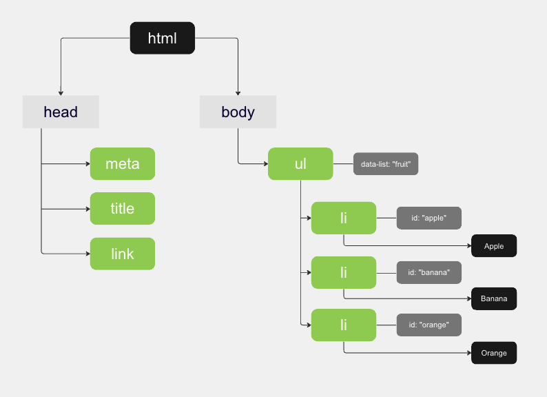

&nbsp;&nbsp;웹 서비스의 화면이 사용자에게 보여지기 까지 뒤에서는 많은 과정이 필요합니다. 본문은 사용자의 브라우저로부터 HTTP 요청이 발생되고, 네트워크에서 처리되는 많은 과정은 생략하고 서버가 응답으로 반환한 정적파일에서 어떤 단계를 거쳐 화면에 그려지는 렌더링의 과정을 살펴보도록 하겠습니다.

<br>

## 브라우저 렌더링 과정

&nbsp;&nbsp;브라우저 요청으로 서버가 반환하는 리소스에는 HTML, CSS, Javascript와 같은 정적 파일이 있습니다. 브라우저는 서버로부터 받은 리소스를 활용해 다음과 같은 과정으로 렌더링을 실시합니다.

<br>

### 1. HTML 파싱(Parsing)

&nbsp;&nbsp;브라우저는 수신 HTML 파일을 가지고 DOM을 생성합니다. HTML은 순수한 텍스트로 이루어진 문서로 브라우저가 HTML에 담긴 텍스트를 토대로 브라우저가 이해할 수 있는 자료구조로 변환하는데 이를 파싱(Parsing)이라 부릅니다. 이제 간단한 예시로 브라우저가 HTML를 DOM으로 파싱하는 과정을 살펴보겠습니다.

<br>

**DOM 트리 구축과정**

1. 브라우저는 서버로부터  HTML 문서를 2진수의 바이트 형태로 응답받습니다. 바이트 형태의 HTML은 `meta` 태그의 `charset` 어트리뷰트에 지정된 인코딩 방식에 따라 문자열로 변환됩니다.
2. 렌더링 엔진은 문자열로 변환된 HTML을 읽어 문법적(syntax) 의미를 갖는 최소 단위인 `토큰(token)`으로 분해합니다.
3. 분해된 토큰은 객체로 변환되며 `노드(Node)`를 생성합니다. 토큰의 내용에 따라 문서 노드, 요소 노드, 어트리뷰트 노드, 텍스트 노드가 생성되는데 이러한 노드들은 DOM을 구성하는 기본 요소입니다.
4. HTML을 구성하는 요소들은 서로 중첩(Nesting) 관계가 될 수 있습니다. 텍스트 역시 다른 요소 사이에 위치할 수 있으며, HTML 요소 간에 부모-자식 관계를 반영해 모든 노드들은 트리(tree) 자료구조로 구성됩니다. 이렇게 만들어진 자료구조를 `DOM(Document Object Model)`이라고 부릅니다.

<br>

&nbsp;&nbsp;아래 코드는 브라우저가 서버로부터 응답받은 HTML의 내용입니다. 이 파일이 DOM으로 변환되었을 때의 DOM 트리는 코드 하단 이미지와 같이 만들어집니다.

```html
<!DOCTYPE html>
<html>
  <head>
    <meta charset="UTF-8">
    <title>Sample</title>
    <link rel="stylesheet" href-"style.css">
  </head>
  <body>
    <ul data-list="fruit">
      <li id="apple">Apple</li>
      <li id="banana">Banana</li>
      <li id="orange">Orange</li>
    </ul>
  </body>
</html>
```



<br>

### 2. CSS 파싱

&nbsp;&nbsp;브라우저의 `렌더링 엔진`은 HTML 문서를 파싱해 DOM을 생성하는 


<br>

**References**
- [모던 자바스크립트 Deep Dive, 브라우저의 렌더링 과정](https://m.yes24.com/Goods/Detail/92742567)
- [MDN Docs, 브라우저는 어떻게 동작하는가](https://developer.mozilla.org/ko/docs/Web/Performance/How_browsers_work)
