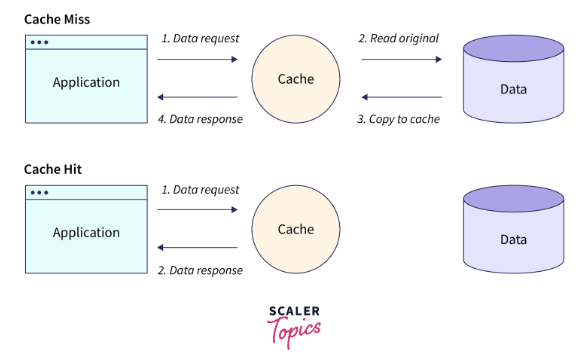
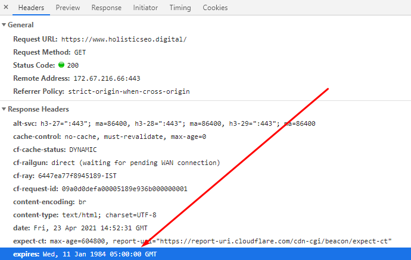

&nbsp;&nbsp;개발자들은 사용자들이 서비스를 이용하는데 있어서 속도 등의 성능 이슈로 인한 불편함을 최소화하기 위해 다양한 노력들을 하는데 이번 포스팅에서는 `Web Cache`를 통한 성능 최적화 방식에 대해 살펴보겠습니다.

&nbsp;&nbsp;클라이언트가 요청하는 자원(Resource)는 보통 HTML, CSS, JS, Images 등의 정적자원입니다. `Web Cache`를 활용하면 최초 요청시에 서버로부터 받은 자원의 복사본을 저장하고, 이후 동일한 자원(URL)에 대한 요청이 발생했을 경우, 저장된 자원(Cache)을 활용하여 더욱 빠르게 서비스를 제공할 수 있습니다.

 

### Web Cache: Server Cache

&nbsp;&nbsp;`Web Cache`의 방법 중 하나는 서버 측에서 캐싱을 통해 클라이언트의 요청에 대한 응답을 빠르게 제공하는 것입니다. 서버는 클라이언트로부터 자주 요청받을 것 같은 내용을 판단하고 필요한 데이터를 메모리/디스크(버퍼)에 저장합니다. 만약 버퍼에 저장된 내용을 클라이언트가 요청했다면 `Cache hit`를 발생시키고, 클라이언트에게 응답을 보냅니다. 반면에 버퍼에 저장되지 않은 내용을 클라이언트가 요청했다면 `Cache miss`가 발생하고, 웹 서버로부터 응답에 대한 결과를 읽어와 클라이언트에 제공합니다. 

`Cache hit`는 캐시에서 데이터를 효과적으로 활용하여 응답을 생성하는 경우이며, `Cache miss`는 캐시에 데이터가 없어 웹 서버에서 데이터를 가져와야 하는 상황을 나타냅니다.

 

### Web Cache: Browser Cache

&nbsp;&nbsp;`Browser Cache`는 요청에 대한 응답을 캐싱하여 이후의 요청에 대해 이미 유효한 데이터를 가지고 있다면 캐싱된 데이터를 활용하여 불필요한 트래픽을 방지하며, 빠르게 화면을 로드할 수 있는 방법입니다. HTTP 환경에서 `Browser Cache`를 활용하기 위해서는 응답 헤더를 활용할 수 있으며 다음과 같은 방법들이 존재합니다.

 

**Expire**

&nbsp;&nbsp;`HTTP/1.0`에서는 캐시를 제어하기 위한 명시적인 기술이 없었으나, `Expire` 헤더를 사용해 웹 서버 데이터의 유효기간을 지정할 수 있었습니다. `Expire` 필드는 데이터의 유효한 날짜를 날짜/시간의 형태의 값으로 가지고 있으며, 만약 유효하지 않은 날짜/시간이라면 해당 데이터는 "신선하지 못한만료된 것으로 처리됩니다. `HTTP/1.1` 이후에는 캐시를 제어하기 위해 `Cache-control` 헤더를 활용하며 `Cache-control` 헤더가 존재할 경우, `Expire` 헤더는 무시됩니다.

 

**Cache-Control**

&nbsp;&nbsp;`Cache-Control`은 `HTTP/1.1`부터 제공되는 헤더로 캐싱을 위한 다양한 옵션들을 제공합니다.

 

**References**
- [MDN Docs, Expires](https://developer.mozilla.org/ko/docs/Web/HTTP/Headers/Expires)
- [holisticseo posts - Expires HTTP](https://www.holisticseo.digital/pagespeed/expires/)