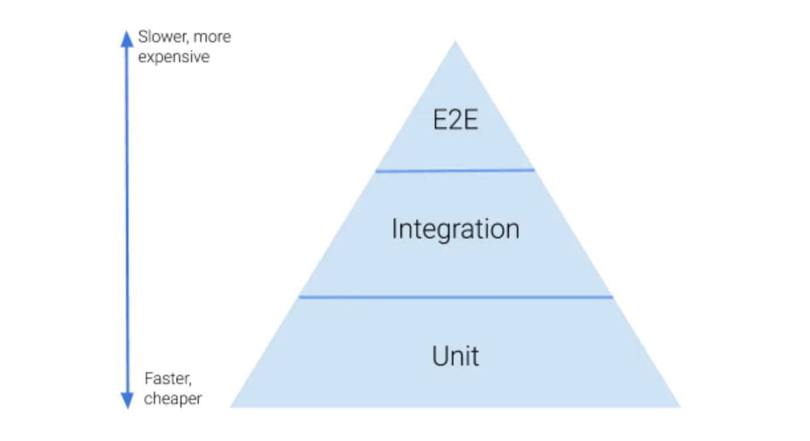

&nbsp;&nbsp;이번에 새롭게 시작하는 프로젝트의 회의에서 다양한 기술을 활용해보려는 만큼 테스트 기법을 도입해 어플리케이션의 성능을 확인하고, 필요한 기술을 적용해 before-after를 체크해보자는 의견이 나왔습니다. 이를 위해 여러 테스트 기법을 조사하던 중, E2E 테스트에 대해 알게 되어 한번 글로 남겨보고자 합니다. 아직 개발한 서비스에 대해 테스트 기반 개발을 진행해본 적이 없기에... 한 카카오 개발자 분이 [카카오 기술 블로그](https://fe-developers.kakaoent.com/2023/230209-e2e/)에 작성하신 내용을 토대로 E2E란 어떤 것인가에 대해 간단하게만 살펴보고자 했습니다.

 

### E2E 테스트

&nbsp;&nbsp;`E2E`는 `End-to-End`의 약자로 E2E 테스트는 개발된 어플리케이션에 대해 모든 사용자의 흐름에 맞춰 테스트를 진행하는 것을 말합니다. 단위 테스트와 통합 테스트는 모듈에 대한 무결성을 확인할 수 있는 기회를 제공하지만, 이는 어플리케이션 관점에서의 무결성을 제공하지는 않습니다. E2E 테스트를 통해 사용자 시나리오에 따라 어플리케이션의 동작을 테스트하고 테스트를 통과하면 어플리케이션 무결성을 증명할 수 있게 됩니다.

 

&nbsp;&nbsp;다만 E2E는 사용자의 모든 시나리오를 고려한 테스트인만큼 단위 테스트와 통합 테스트에 비해 많은 비용과 시간을 할애해야 합니다. 위 그림은 테스트 단계별로 들어가는 비용과 시간의 비중을 표현해주는 [테스트 피라미드](https://betterprogramming.pub/the-test-pyramid-80d77535573)입니다.

 
### E2E 테스트 도입 전 고려사항

&nbsp;&nbsp;많은 분들의 개발자 분들의 회고록을 보면 실제 운영하던 서비스에서 E2E 테스트를 걷어낼 만큼 어렵다고 합니다... [카카오 기술 블로그](https://fe-developers.kakaoent.com/2023/230209-e2e/)에서는  E2E 테스트의 도입에 앞서 고려해야할 사항을 다음과 같이 제시하고 있습니다.

 

**1. QA팀 의 하위호환**

&nbsp;&nbsp;`QA`는 Quality Assurance의 약자로 서비스 개발에서 개발된 어플리케이션에 대한 테스트를 진행하고, 어플리케이션에 대한 품질을 보증하는 것을 말합니다. 규모가 작은 기업에서는 개발팀이 직접 테스트를 진행해 기능 및 품질 테스트를 진행하지만 규모가 좀 있다면 QA를 전담하는 팀이 별도로 존재합니다.

&nbsp;&nbsp;QA팀은 어플리케이션에 대한 품질을 체크하기 위해 다양한 사용자 시나리오에 맞춰 테스트를 진행하고, 버그가 있다면 이를 개발팀에 공유합니다. 이는 앞서 이야기 했던 E2E 테스트와 동일한 업무를 수행함을 말하게 되는데 아무래도 QA팀은 전문성을 갖춘 집단인만큼 개발팀에서 진행하는 E2E에 비해 정확한 테스트를 진행할 것이며, 개발팀에서 QA에서 하는 테스트를 중복해서 한다는 느낌도 있습니다.

 

 

**References**
- [E2E 테스트 도입 경험기](https://fe-developers.kakaoent.com/2023/230209-e2e/)
- [The Test Piramid](https://betterprogramming.pub/the-test-pyramid-80d77535573)